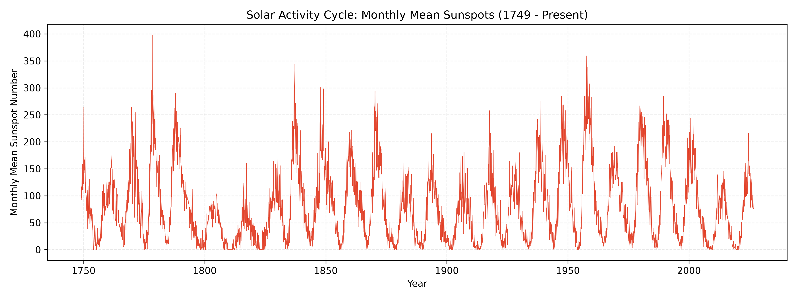

Markdown
# 太阳活动周期与黑子数可视化 (Solar Activity Cycle)

## 现象描述 (The Phenomenon)
本可视化项目关注的是**太阳黑子数（Sunspot Number）及其背后的 11 年太阳活动周期**。太阳核心的核聚变能量释放、磁场变动以及太阳风暴的频繁程度，都会在太阳表面以黑子多少的形式周期性地表现出来。这是一个跨越数百年的天然宏观规律——无论人类是否观测它，太阳每隔大约 11 年就会经历一次从平静到活跃再到平静的往复。通过将长达数个世纪的观测数据绘制成图，我们可以直观地看到这种巨大的宇宙韵律。

## 数据来源 (The Source)
* **数据提供方**：国际太阳黑子指数中心（SILSO, Royal Observatory of Belgium）
* **数据链接**：[https://www.sidc.be/SILSO/datafiles](https://www.sidc.be/SILSO/datafiles)
* **文件说明**：数据文件 `data/sunspots.csv` 记录了自 1749 年 1 月至今的月度平均总太阳黑子数。每一行代表一个月，包含年份、月份、平均黑子数及观测标准差等字段。

## 可视化结果 (The Picture)


## 图表展示了什么与隐藏了什么 (What it shows and what it hides)
* **展示了什么**：图表清晰地呈现了近 270 年来月平均太阳黑子数的起伏波峰与波谷，完美展现了标志性的 11 年周期规律，以及不同周期之间活跃强度的显著差异。
* **隐藏了什么**：该图通过月度平均值平滑掉了太阳自转（约 27 天周期）带来的短期黑子数量剧烈波动；同时，它将整个太阳作为一个整体来看待，隐藏了太阳南北半球活动不对称性以及太阳表面具体纬度的分布细节。

## 如何运行 (How to run it)
本项目完全可以在无网络环境下运行（原始数据已缓存在 `data/` 中）。只需在终端执行以下命令：

```bash
uv run plot.py