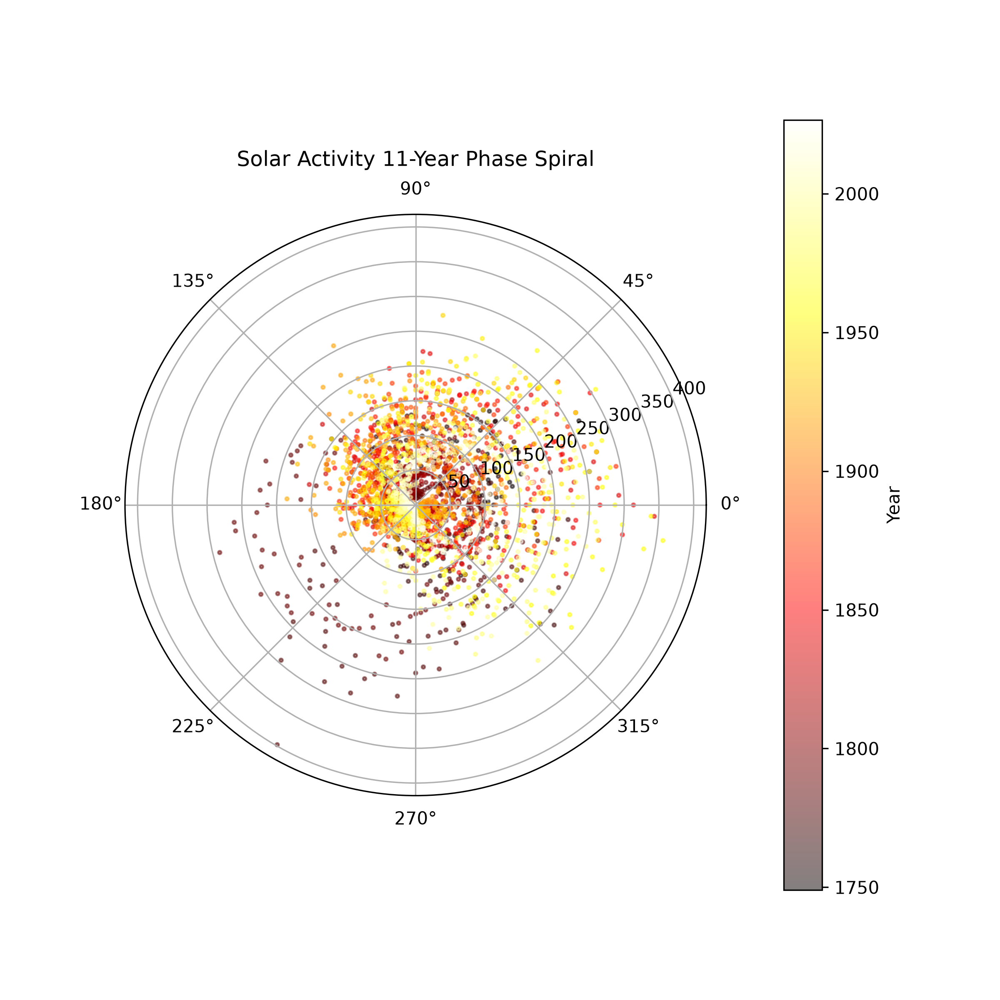
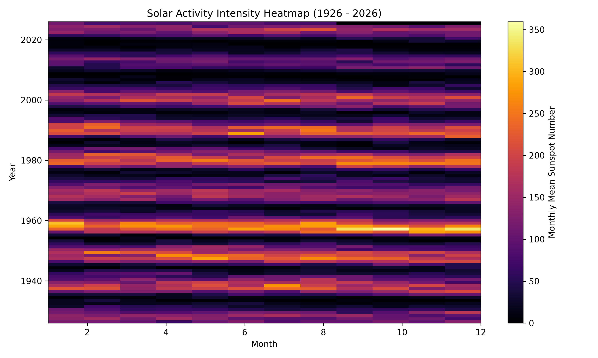

# 太阳活动与黑子周期可视化 (Solar Activity & Sunspot Cycles)

## 现象描述 (The Phenomenon)
本可视化项目聚焦于**太阳黑子数（Sunspot Number）及其随时间推移呈现的 11 年太阳活动周期**。太阳核心内部的磁场变动和核聚变能量释放，会周期性地在太阳表面催生出数量不一的黑子。这是一个跨越近三个世纪的自然宏观韵律——无论人类是否对其进行观测，太阳始终在平静与活跃之间往复交替。通过将长达数百年的历史观测数据转化为图像，我们可以直观审视这种巨大的宇宙节律。

## 数据来源 (The Source)
* **数据提供方**：国际太阳黑子指数中心（SILSO, Royal Observatory of Belgium）
* **数据链接**：[https://www.sidc.be/SILSO/datafiles](https://www.sidc.be/SILSO/datafiles)
* **文件说明**：原始数据文件 `data/sunspots.csv` 记录了自 1749 年 1 月至今的月度平均总太阳黑子数。每一行代表一个月，包含年份、月份、平均黑子数及观测标准差等字段，完全离线缓存。

## 可视化结果 (The Pictures)

### 1. 百年线性周期折线图 (Linear Trend)


### 2. 11年极坐标螺旋图 (Polar Spiral)


### 3. 百年强度热力矩阵图 (Heatmap Matrix)


## 图表展示了什么与隐藏了什么 (What they show and what they hide)
* **线性折线图**展示了近 270 年来太阳黑子数起伏的宏观全貌，凸显了标志性的 11 年周期规律；但它在长达数世纪的时间跨度下显得过于拥挤，隐藏了单个周期内部细节的相位重合度。
* **极坐标螺旋图**将时间按照 11 年为一个周期进行折叠卷曲，直观展现了不同历史周期之间峰值的相位对齐与强度差异；但它将连续的线性流逝变成了循环，弱化了绝对年份的直观先后顺序。
* **热力矩阵图**通过色彩深浅直观暴露出近百年中哪几个特定年份是绝对的爆发高峰；但它将连续的波动离散为了网格，平滑掉了月度内更细腻的动态变化。

## 如何运行 (How to run it)
本项目在完全无网环境下可直接运行。通过 `uv` 自动管理依赖并执行脚本：

```bash
uv run fetch.py        # 获取并缓存原始数据到 data/
uv run plot.py         # 生成线性折线图
uv run sun_spiral.py   # 生成极坐标螺旋图
uv run sun_heatmap.py  # 生成百年色彩热力图
